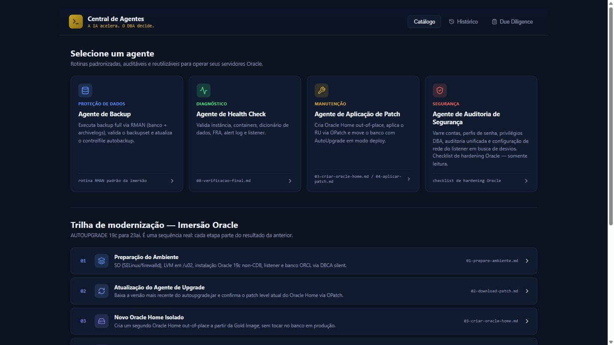
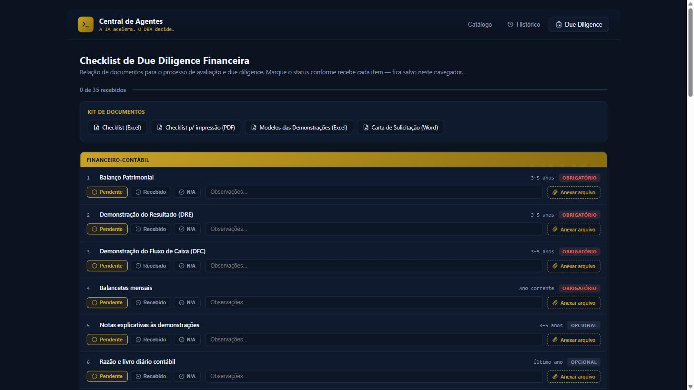

# 📰 Portfólio LinkedIn — Frederick Moura
### Publicações Técnico-Executivas para Gestores Oracle & CIOs

> Curadoria das publicações mais recentes no LinkedIn, traduzindo entregas técnicas em **valor de negócio** — disponibilidade, segurança, redução de custo operacional e governança de dados em ambientes Oracle de missão crítica.

🔗 **Perfil completo:** [linkedin.com/in/frederick-moura-30a99827](https://www.linkedin.com/in/frederick-moura-30a99827/)  
📅 **Última atualização:** Maio/2026

---

## 🎯 Por que este portfólio interessa a um CIO ou Gestor Oracle?

Cada publicação a seguir documenta uma **capacidade técnica executada em laboratório real (Oracle 19c + IA como copiloto)**, com foco direto nos indicadores que importam para o negócio:

| Indicador de Negócio | Resultado Demonstrado |
|----------------------|------------------------|
| ⏱️ **Tempo de execução** | Até **70% de redução** em práticas avançadas de administração |
| 🛡️ **Continuidade de negócio** | RTO/RPO reduzido com Flashback, RMAN e Recovery seletivo |
| 📋 **Conformidade & Auditoria** | Documentação automática gerada a cada operação |
| 💰 **Eficiência operacional** | Eliminação de retrabalho e erros humanos |
| 🚀 **Time-to-market** | Provisão ágil de clones para homologação e testes |

---

## 1) ⚡ Flashback Database em Oracle 19C com IA

**Skill executada:** `configure-flashback`  
**Resultado técnico:** Ambiente ORCL com `FLASHBACK_ON = YES`, retenção de 24h, logs criados e validação automática.

### 💼 Valor para o CIO
- **Recuperação instantânea** de erros humanos e incidentes lógicos sem necessidade de restore completo.
- **Redução direta de RTO** — reversão de transações em minutos, não em horas.
- **Auditoria simplificada** — trilha completa de mudanças disponível para compliance (LGPD, SOX, ISO 27001).

### 🧠 Mensagem estratégica
O DBA deixa de atuar de forma reativa e passa a operar em **modo proativo e inteligente**, com IA como copiloto técnico.

🔗 [Ver publicação original no LinkedIn](https://www.linkedin.com/in/frederick-moura-30a99827/recent-activity/all/)

---

## 2) 🖥️ RMAN DUPLICATE — Clonagem ORCL → ORCLDUP com IA

**Skill executada:** `rman-duplicate`  
**Resultado técnico:** Clone ORCLDUP operacional, íntegro e validado, pronto para testes, auditorias e ambientes de homologação.

### 💼 Valor para o CIO
- **Provisão ágil** de ambientes não-produtivos sem impactar a base principal.
- **Aceleração do time-to-market** de novas releases e patches.
- **Redução de risco** ao garantir que testes ocorram em réplica fiel da produção.

### 🧠 Mensagem estratégica
Processo **automatizado, documentado e livre de erros** — replicável em escala para projetos de modernização e migração.

🔗 [Ver publicação original no LinkedIn](https://www.linkedin.com/in/frederick-moura-30a99827/recent-activity/all/)

---

## 3) 📀 RMAN RECOVER TABLE — Recuperação Granular de HR.EMPLOYEES

**Skill executada:** `rman-recover-table`  
**Resultado técnico:** 107 linhas da tabela HR.EMPLOYEES recuperadas após DROP. Dados exportados e importados como HR.EMPLOYEES_RECOVERED, preservando integridade salarial e distribuição por departamento.

### 💼 Valor para o CIO
- **Recuperação cirúrgica** de objetos críticos sem indisponibilizar a base inteira.
- **Proteção de dados sensíveis** (RH, financeiro, cadastros regulatórios).
- **Manutenção do SLA** durante incidentes lógicos pontuais.

### 🧠 Mensagem estratégica
Demonstra maturidade em **estratégias de recuperação seletiva** — pilar essencial em ambientes regulados e auditados.

🔗 [Ver publicação original no LinkedIn](https://www.linkedin.com/in/frederick-moura-30a99827/recent-activity/all/)

---

## 4) 🖥️ Recovery Full — Perda Total de Datafiles em Oracle 19C

**Skill executada:** `recovery-full`  
**Resultado técnico:** Cenário real simulado de perda total. RMAN localizou o backup mais recente, executou RESTORE e RECOVER em paralelo (2 canais). Banco reaberto em READ WRITE com **72.374 objetos acessíveis**.

### 💼 Valor para o CIO
- **Disaster Recovery comprovado** com rastreabilidade ponta a ponta.
- **Continuidade de negócio garantida** mesmo em cenários catastróficos.
- **Evidência automática** pronta para auditorias regulatórias e certificações.

### 🧠 Mensagem estratégica
Com IA, o DBA **antecipa soluções** em vez de apenas reagir. Quem sai na frente nessa revolução conquista **vantagem competitiva real**.

🔗 [Ver publicação original no LinkedIn](https://www.linkedin.com/in/frederick-moura-30a99827/recent-activity/all/)

## 5) 🤖 Central de Agentes de IA

Construí minha própria Central de Agentes de IA.

Não é um app genérico de IA. É uma central com agentes especializados, cada um com uma rotina real por trás — construída em cima do que eu já rodo no lab.

O catálogo hoje tem 4 agentes:

→ **Agente de Backup** — executa RMAN full (banco + archivelogs), valida o backupset e atualiza o controlfile autobackup. Rotina padrão da imersão, sem passo manual.

→ **Agente de Health Check** — valida instância, containers, dicionário de dados, FRA, alert log e listener. Reaproveita os comandos reais de verificação final que eu já usava na imersão.

→ **Agente de Aplicação de Patch** — cria Oracle Home out-of-place, aplica RU via OPatch e move o banco com AutoUpgrade em modo deploy. Fluxo genérico, mas nasceu das atividades de patch com zero downtime de dados.

→ **Agente de Auditoria de Segurança** — varre contas, perfis de senha, privilégios DBA e configuração de listener. Checklist de hardening Oracle, somente leitura.

Junto com isso, montei a trilha completa de modernização — AUTOUPGRADE 19c para 23ai em 8 etapas encadeadas, onde cada passo parte literalmente do resultado do anterior: preparação do ambiente → novo Oracle Home isolado → patch sem downtime → migração para multitenant → upgrade para 23ai → patch incremental → verificação final.

E para a vertical de Valuation, entrou um módulo de Due Diligence Financeira: checklist de 35 documentos organizados por bloco (financeiro-contábil e além), com status por item, upload de anexo e kit de documentos pronto (checklist em Excel, PDF para impressão, modelos de demonstrações, carta de solicitação em Word).

O agente não decide. Ele padroniza, executa e documenta. Quem interpreta risco, aprova patch ou valida due diligence continua sendo o profissional.

**A IA acelera. O DBA decide.**

`#Oracle` `#Oracle23ai` `#DBA` `#PerformanceTuning` `#IA` `#ClaudeCode`

---

## 📊 Síntese Executiva

| Publicação | Skill Oracle | Indicador Crítico Atendido |
|------------|--------------|------------------------------|
| 1. Flashback Database | `configure-flashback` | RTO + Auditoria |
| 2. RMAN Duplicate | `rman-duplicate` | Time-to-market + Homologação |
| 3. RMAN Recover Table | `rman-recover-table` | Recuperação Granular + SLA |
| 4. Recovery Full | `recovery-full` | Disaster Recovery + Compliance |
| 5. Central de Agentes de IA | central-de-agentes | Padronização + Governança + Due Diligence |

---

## 🤝 Vamos conversar?

Se você é **CIO, Gerente de TI ou Líder de Dados** buscando profissionais que entreguem bancos Oracle **estáveis, seguros e prontos para a era da IA**, fico à disposição para uma conversa estratégica.

📫 **Contato:** [LinkedIn — Frederick Moura](https://www.linkedin.com/in/frederick-moura-30a99827/)

> *"A excelência em banco de dados é a base silenciosa que sustenta cada decisão estratégica de negócio."*
